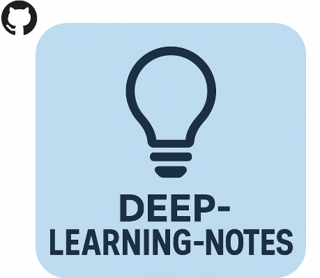

# 📘 deep-learning-notes

<p align="center">
  
</p>

<p align="center">
  <strong>全面、系统的深度学习笔记 —— 从数学基础到大模型部署</strong>
</p>

<p align="center">
  <a href="https://github.com/yourusername/deep-learning-notes/blob/main/LICENSE"></a>
  <a href="#contributing"></a>
</p>

---

## 关于本项目

这是一套系统化的深度学习笔记，覆盖从机器学习基础理论到 2025 年最新大模型技术的完整知识体系。项目旨在为深度学习学习者、研究者和工程师提供一份**结构清晰、内容详实、持续更新**的参考资料。

### 核心理念

- **体系化**：按主题域组织，而非零散堆积
- **深度优先**：每个主题包含数学推导、代码示例和参考文献
- **紧跟前沿**：持续追踪 LLM、MLLM、扩散模型等最新进展
- **开源协作**：欢迎社区贡献，共同完善

---

## 📂 文档结构

```
docs/
├── getting-started/          # 入门指南
│   ├── learning-roadmap.md   # 学习路线图
│   └── environment-setup.md  # 环境配置（GPU、CUDA、PyTorch）
├── fundamentals/             # 基础理论
│   ├── math-foundations.md   # 数学基础（推导的地基）
│   └── machine-learning.md   # 机器学习概述
├── architectures/            # 模型架构
│   ├── transformer.md        # Transformer 架构详解
│   ├── cnn.md                # 卷积神经网络
│   ├── rnn-lstm.md           # 循环神经网络
│   ├── gan.md                # 生成对抗网络
│   └── diffusion.md          # 扩散模型
├── training/                 # 训练技术
│   ├── training-pipeline.md  # 完整训练流程
│   ├── backpropagation.md    # 反向传播完整推导
│   ├── optimization.md       # 优化器详解
│   ├── regularization.md     # 正则化技术
│   └── distributed.md        # 分布式训练
├── llm-mllm/                 # 大模型专题
│   ├── survey.md             # LLM/MLLM/生成模型全景调研
│   ├── fine-tuning.md        # 微调技术（LoRA、QLoRA 等）
│   └── inference.md          # 推理优化（KV Cache、量化等）
├── deployment/               # 模型部署
│   └── model-serving.md      # 模型服务化与推理加速
└── resources/                # 资源汇总
    ├── datasets.md           # 常用数据集
    ├── learning-resources.md # 学习资源
    └── tools.md              # 常用工具命令
```

---

## 🚀 快速开始

### 在线阅读

访问文档网站（即将上线）获得最佳阅读体验。

### 本地阅读

```bash
git clone https://github.com/yourusername/deep-learning-notes.git
cd deep-learning-notes
```

所有文档均为 Markdown 格式，可直接在 VS Code、Obsidian 或任何 Markdown 阅读器中查看。

### 本地预览与公式校验

项目使用 **MkDocs + Material + KaTeX** 渲染文档，数学公式在浏览器中正常显示：

```bash
# 1. 安装依赖
python3 -m venv .venv && source .venv/bin/activate
pip install -r requirements.txt
npm install   # 公式校验所需的 KaTeX

# 2. 本地预览（支持公式实时渲染）
mkdocs serve

# 3. 校验所有数学公式可编译（KaTeX，CI 也会执行）
node scripts/check_math.mjs

# 4. 严格构建（CI 使用，任何警告都会失败）
mkdocs build --strict
```

---

## 📚 内容覆盖

| 主题域 | 内容 |
|--------|------|
| **基础理论** | 机器学习三要素、偏差-方差、过拟合/欠拟合、交叉验证 |
| **经典架构** | CNN (LeNet→ResNet→EfficientNet)、RNN/LSTM/GRU、Transformer、GAN、Diffusion |
| **训练技术** | SGD/Adam/AdamW、学习率调度、Dropout/BN/LN、混合精度、分布式训练 |
| **大模型** | LLM 全景调研、LoRA/QLoRA 微调、RLHF/DPO 对齐、KV Cache、Flash Attention、量化 |
| **模型部署** | ONNX、TensorRT、vLLM、模型量化 (GPTQ/AWQ)、服务化部署 |
| **工具链** | Git、Conda、Docker、Linux、Tmux、常用 Python 库 |

---

## 🤝 贡献指南

我们欢迎所有形式的贡献！无论是修正笔误、补充内容、还是新增章节，都可以通过 Issue 或 PR 参与。

详细指南请参见 [CONTRIBUTING.md](./CONTRIBUTING.md)。

### 贡献者

感谢所有为本项目做出贡献的开发者！

---

## 📄 许可证

本项目基于 [MIT License](./LICENSE) 开源。

---

## ⭐ Star History

如果本项目对你有帮助，欢迎 Star ⭐

---

## 📧 联系方式

如有问题或建议，欢迎通过 GitHub Issue 交流。
