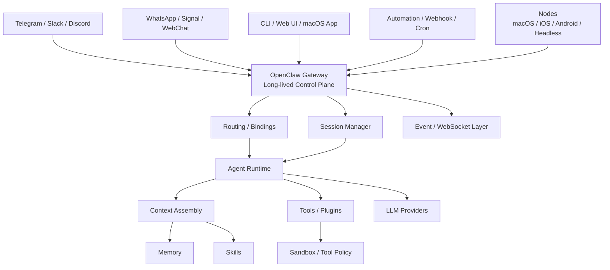
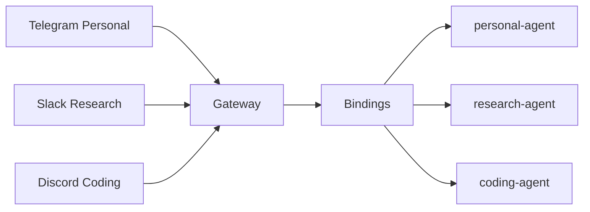
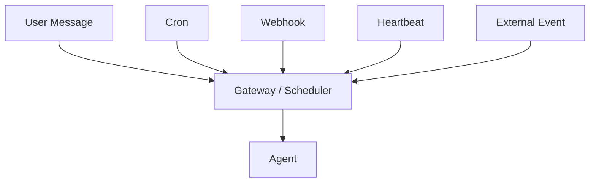
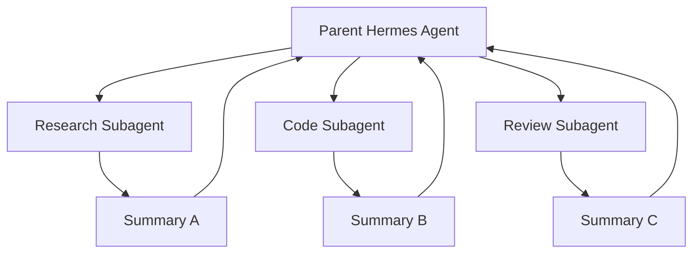

# Agent Runtime：OpenClaw 与 Hermes Agent 架构对比

> 一份面向 AI Agent / Agent Systems 学习与研究的技术综述  
> 资料核验日期：2026-08-14  
> 主要依据：OpenClaw 官方文档、Hermes Agent 官方文档与 Nous Research 官方仓库

---

## 摘要

OpenClaw 和 Hermes Agent 都已经超出了“LLM + Tool Calling”的简单 Agent 范畴。它们都试图解决一个更困难的问题：

> **如何把大模型从一次性的推理函数，变成一个长期在线、有状态、有记忆、可执行动作、能够与外部世界持续交互的软件实体。**

但二者的架构重心不同。

- **OpenClaw** 更偏向 **Agent Runtime / Gateway / Agent OS 基础设施**。
  - 强调 Gateway 控制平面；
  - 多渠道消息接入与路由；
  - 多 Agent 隔离；
  - Session / Memory 生命周期；
  - Tool Policy、Sandbox 和权限边界；
  - 插件、Node、自动化等运行时能力。

- **Hermes Agent** 更偏向 **可持续学习的 Personal Agent / Autonomous Agent**。
  - 强调持久记忆；
  - Agent 自主管理 Skills；
  - 从任务经验中沉淀 procedural knowledge；
  - Subagent delegation；
  - 多 Profile 与 durable Kanban 协作；
  - 面向个人计算机、CLI、研究和开发任务的自主执行。

可以先用一句话建立直觉：

> **普通 Agent 重点是“完成一次任务”；OpenClaw 重点是“如何长期运行和管理 Agent”；Hermes Agent 重点是“如何让长期运行的 Agent 从经验中持续积累能力”。**

---

# 1. 从“普通 Agent”开始理解

## 1.1 最简单的 Agent

传统 LLM 应用通常是：

```text
User
  │
  ▼
Prompt
  │
  ▼
LLM
  │
  ▼
Response
```

加入 Tool Calling 后：

```text
User
  │
  ▼
LLM
  │
  ├── final answer ──────────────► User
  │
  └── tool_call
         │
         ▼
       Tool
         │
         ▼
    Tool Result
         │
         └────────────► LLM
```

其核心可以写成：

$$
Agent \approx LLM + Tools + Agentic\ Loop
$$

典型 Agent loop 是：

1. 接收用户任务；
2. 构造 prompt/context；
3. 调用 LLM；
4. 如果模型请求工具，则执行工具；
5. 把工具结果返回给模型；
6. 重复直到输出最终结果。

这种 Agent 已经能完成搜索、代码执行、文件读写、浏览器操作等多步骤任务。

但它仍然没有解决以下系统问题：

- Agent 是否持续在线？
- 多个用户如何接入？
- Telegram、Slack、Web、CLI 如何统一？
- Session 如何恢复？
- Agent 如何跨 Session 记忆？
- 多个 Agent 如何隔离？
- Agent 执行 shell 时如何控制风险？
- Agent 如何被 Cron、Webhook、事件主动唤醒？
- 工具、模型、插件和设备如何动态扩展？
- 长期运行时 Context 如何避免无限增长？

这些正是 OpenClaw、Hermes Agent 等“Agent Runtime”项目开始解决的问题。

---

# 2. OpenClaw 的定位

OpenClaw 可以理解为一个：

> **长期运行的、自托管的 Agent Gateway + Agent Runtime + Integration Platform。**

它并不是主要试图提出新的 LLM reasoning algorithm。

它更关注：

```text
               Agent Systems
                    │
     ┌──────────────┼──────────────┐
     │              │              │
   Routing       State          Execution
     │              │              │
 Channels       Session         Tools
 Gateway        Memory          Sandbox
 Bindings       Workspace       Plugins
```

因此，从系统工程角度：

$$
OpenClaw
\approx
Gateway
+
Agent\ Runtime
+
Persistent\ State
+
Capability\ System
+
Security\ Boundary
+
Automation
$$

---

# 3. OpenClaw 总体架构

OpenClaw 官方架构的核心是一个 **long-lived Gateway**。



OpenClaw 的 Gateway 长期驻留并拥有消息入口。控制客户端和 Node 通过 WebSocket 与 Gateway 连接。

因此 OpenClaw 并不是：

```text
python app.py
    ↓
agent.run()
    ↓
finish
```

而更接近：

```text
systemd / daemon
      │
      ▼
OpenClaw Gateway
      │
      ├──── Session A
      ├──── Session B
      ├──── Agent A
      ├──── Agent B
      ├──── Telegram
      ├──── Slack
      └──── Automation
```

这意味着 **Agent 生命周期可以远长于一次模型调用**。

参考：[OpenClaw Gateway Architecture][oc-architecture]

---

# 4. Gateway：OpenClaw 的控制平面

Gateway 是 OpenClaw 最具有辨识度的架构设计之一。

它负责的不是模型推理本身，而是 Agent 运行所需要的外围控制。

主要职责可以抽象为：

```text
Gateway
├── Channel adapters
├── WebSocket control plane
├── Agent routing
├── Session routing
├── Message lifecycle
├── Node connectivity
├── Presence / events
├── Automation
└── Agent invocation
```

从分布式系统角度，可以把它类比为：

- Kubernetes 中的控制面；
- 操作系统中的长期 daemon；
- IM 系统中的 message gateway；
- 微服务架构中的 API Gateway + state coordinator。

但它管理的核心对象不是 HTTP 服务，而是 **Agent、Session、Channel 和 Tool execution**。

---

# 5. OpenClaw 的 Agent Runtime

Gateway 完成路由后，任务进入 Agent Runtime。

官方将 Agent loop 描述为一个按 Session 串行运行的过程，大致包括：

```text
Message Intake
      │
      ▼
Context Assembly
      │
      ▼
Model Inference
      │
      ▼
┌───────────────────┐
│ Need Tool Call ?  │
└──────┬─────┬──────┘
       │Yes  │No
       ▼     ▼
     Tool   Reply
       │
       ▼
 Tool Result
       │
       └──────────────► Model
```

因此：

$$
AgentRuntime =
ContextAssembly
+
Inference
+
ToolExecution
+
Persistence
+
Streaming
$$

当前 OpenClaw 将核心 Runtime 内建在自身项目中，核心代码边界包括：

```text
src/agents/
    Agent runtime / hooks / harness

src/llm/
    Model providers / transport / streaming

plugin-sdk/
    对插件暴露的稳定能力接口
```

其 Runtime 还支持 harness abstraction：某些底层 Agent turn 可以由插件注册的其他 harness 执行，例如 Codex harness。

这说明 OpenClaw 实际上在分离：

```text
Agent Platform
      │
      ▼
Agent Runtime Interface
      │
 ┌────┴──────────┐
 ▼               ▼
OpenClaw       External
Runtime        Harness
                 │
                 ▼
               Codex
```

参考：[OpenClaw Agent Runtime Architecture][oc-runtime]、[Agent Loop][oc-loop]

---

# 6. Workspace：Agent 的持久化“人格与工作空间”

一个 OpenClaw Agent 不只是一个 system prompt。

它拥有自己的 Workspace、state directory 和 session store。

常见的 Workspace 内容包括：

```text
workspace/
├── AGENTS.md
├── SOUL.md
├── USER.md
├── MEMORY.md
└── project files...
```

可以粗略理解为：

| 文件 | 语义 |
|---|---|
| `SOUL.md` | Agent 的人格、风格、行为边界 |
| `AGENTS.md` | 工作规则、项目约束、操作方式 |
| `USER.md` | 用户偏好和用户相关知识 |
| `MEMORY.md` | 长期记忆 |
| 其他文件 | Agent 可读取或维护的工作资产 |

这种设计的重要特点是 **Inspectable State**。

也就是说，一部分 Agent 长期状态并不是藏在不可见数据库里，而是可以直接：

```bash
cat MEMORY.md
vim AGENTS.md
git diff
```

进行检查、修改和版本管理。

这对 Agent 可解释性、调试和治理很重要。

---

# 7. Session、Context 与 Memory 必须区分

这三个概念经常被混淆。

## 7.1 Session

Session 是一次持续对话或任务流的状态单元。

它可能包含：

- user/assistant messages；
- tool call；
- tool result；
- routing state；
- compaction state；
- transcript metadata。

## 7.2 Context

Context 是 **某一次 LLM 调用实际看到的 token 集合**。

可以抽象成：

$$
C_t =
S
+
H_t
+
T_t
+
R_t
+
W
$$

其中：

- $S$：system instructions；
- $H_t$：conversation history；
- $T_t$：tool call/result；
- $R_t$：retrieved memory；
- $W$：workspace/context files。

Context 受到模型 context window 的硬限制。

## 7.3 Memory

Memory 是跨 Session 持续存在的知识。

因此：

```text
Session != Memory
Context != Memory
Session != Context
```

更准确的关系是：

```text
Persistent Memory
        │
        │ retrieval
        ▼
     Context
        ▲
        │
Session History
```

---

# 8. OpenClaw Memory 架构

OpenClaw 的 Memory 已经不仅是单一 Markdown 文件。

当前默认 Builtin Memory Engine 基于 SQLite，并支持：

- keyword search；
- vector similarity；
- hybrid search；
- semantic recall。

检索逻辑可以概括为：

```text
User Query
    │
    ▼
Memory Search
   / \
  /   \
Keyword Semantic
Search  Vector
  \     /
   \   /
   Ranking
      │
      ▼
Relevant Memory
      │
      ▼
Current Context
```

在配置 embedding provider 时，OpenClaw 可以使用 hybrid retrieval：

$$
Score(m,q)
=
\alpha \cdot Semantic(m,q)
+
\beta \cdot Keyword(m,q)
$$

这里的价值是：

- Vector search 对语义近义表达友好；
- Keyword search 对 ID、函数名、代码符号、专有名词更可靠。

此外 OpenClaw 还有可插拔 Memory Engine，例如 Honcho、LanceDB，以及用于构造结构化长期知识的 Memory Wiki。

参考：[OpenClaw Memory][oc-memory]

---

# 9. 为什么长期 Agent 必须做 Context Lifecycle Management

长期运行时最直接的问题是 Context 不断增长。

假设每轮增加：

$$
\Delta C_t
=
Message_t
+
ToolResult_t
+
Memory_t
$$

则：

$$
|C_t|
=
|C_0|
+
\sum_{i=1}^{t}\Delta C_i
$$

最终必然接近：

$$
|C_t| \approx ContextWindow
$$

所以真正的长期 Agent 必须具备：

```text
Long History
    │
    ├── Keep Recent Context
    │
    ├── Compact Old History
    │
    ├── Prune Tool Results
    │
    └── Promote Important Knowledge
              │
              ▼
            Memory
```

因此成熟 Agent Runtime 的核心问题并不只是 reasoning：

> **Context lifecycle management 本身就是 Agent Systems 的核心研究问题。**

OpenClaw 在 Runtime 中提供 compaction、context pruning 和 memory flush 等机制，就是为了解决这一问题。

---

# 10. Tools、Skills 与 Plugins

OpenClaw 对能力进行了较明确的分层。

## 10.1 Tool

Tool 是一个可调用动作：

```text
Tool = Action Primitive
```

例如：

```text
file.read
shell.exec
browser.navigate
browser.click
memory_search
```

LLM 决定何时调用 Tool。

---

## 10.2 Skill

Skill 是指导 Agent 如何完成某类任务的 procedure。

```text
Skill = Procedural Knowledge
```

例如：

```text
GitHub PR Review Skill
    │
    ├── inspect diff
    ├── run tests
    ├── check security
    ├── summarize findings
    └── post review
```

Skill 本身通常不是底层执行 primitive，而是：

> **告诉 Agent 怎样组合 Tool。**

OpenClaw Skill 使用 `SKILL.md` 描述，并可根据环境、配置、binary presence、allowlist 等进行过滤。

参考：[OpenClaw Skills][oc-skills]

---

## 10.3 Plugin

Plugin 是 Runtime-level extension。

它可以扩展：

```text
Plugin
├── Tools
├── Skills
├── Channels
├── Model Providers
├── Agent Harness
├── Hooks
├── Speech
├── Media
├── Web Search
└── Web Fetch
```

因此：

$$
Plugin > Skill > Tool
$$

并不是严格继承关系，而是能力层级逐渐上移：

```text
Tool
  ↓
执行原语

Skill
  ↓
过程知识

Plugin
  ↓
Runtime 扩展机制
```

参考：[OpenClaw Capability Overview][oc-tools]、[Plugins][oc-plugins]

---

# 11. Multi-Agent：OpenClaw 的重要能力

OpenClaw 支持在一个 Gateway 中运行多个隔离 Agent。

官方定义下，一个 Agent 可以拥有独立的：

```text
Agent
├── Workspace
├── State Directory
├── Auth Profiles
├── Model Registry
├── Session Store
├── Skills
├── Tool Policy
└── Sandbox Configuration
```

消息通过 Binding 路由。

例如：



这比“在 Prompt 里告诉一个模型扮演三个角色”强得多。

因为这里存在真正的：

- State isolation；
- Session isolation；
- Workspace isolation；
- Auth/config separation；
- Tool policy separation。

所以 OpenClaw 的 Multi-Agent 首先是一个 **systems abstraction**，其次才是 reasoning abstraction。

参考：[OpenClaw Multi-Agent Routing][oc-multi]

---

# 12. Subagent 与 Multi-Agent 不是同一概念

还需要区分：

```text
Persistent Agent
vs
Subagent
```

Persistent Agent：

- 长期存在；
- 有独立 identity；
- 有长期 state；
- 有长期 session/memory；
- 可以绑定消息渠道。

Subagent：

- 通常为某个任务临时创建；
- 获得隔离 context；
- 完成子任务后返回结果；
- 更像并行 worker。

例如：

```text
Main Agent
   │
   ├── Research Subagent
   ├── Coding Subagent
   └── Review Subagent
```

Subagent 的价值是：

1. Context isolation；
2. Parallelism；
3. Role specialization；
4. 防止大量中间 tool output 污染主 Agent context。

OpenClaw 同样支持 Sub-agent orchestration。

---

# 13. Sandbox：为什么 Agent Runtime 不能只依赖 Prompt 安全

如果 Agent 可以执行：

```bash
rm
curl
git
ssh
python
docker
```

那么仅仅告诉 LLM：

> “请不要执行危险命令。”

不是可靠的安全边界。

更合理的执行路径应该是：

```text
LLM
 │
 ▼
Tool Request
 │
 ▼
Tool Policy
 │
 ▼
Approval / Permission
 │
 ▼
Sandbox
 │
 ▼
OS / Network / Filesystem
```

因此：

$$
Safety
=
PromptConstraint
+
ToolPolicy
+
Approval
+
Sandbox
+
OSBoundary
$$

OpenClaw 可以按 Agent 配置不同的 sandbox 和 tool restrictions。

需要注意的是：

> Workspace 本身只是默认工作目录，不天然等于硬安全边界。只有启用 Sandbox 等机制之后，才能形成更强的执行隔离。

参考：[OpenClaw Multi-Agent Sandbox][oc-multi-sandbox]

---

# 14. Automation：从 Reactive Agent 到 Persistent Agent

普通聊天 Agent 的触发方式通常只有：

```text
User Message → Agent
```

长期 Agent 则可能由：

```text
User
Cron
Webhook
Heartbeat
Event
System
```

共同触发。

于是：



这意味着 Agent 不再只是被动聊天机器人，而可以成为：

$$
Reactive\ Agent
\rightarrow
EventDriven\ Persistent\ Agent
$$

例如：

- 每天生成日报；
- 定期检查某个服务；
- 发现事件后主动发送消息；
- 定时整理 Memory；
- 自动执行维护工作流。

---

# 15. OpenClaw 与普通 Agent 的核心区别

可以用一张表总结。

| 维度 | 普通 Agent | OpenClaw |
|---|---|---|
| 生命周期 | 一次任务或单进程 | 长期运行 |
| 核心对象 | LLM 调用 | Agent / Session / Gateway |
| 状态 | 临时居多 | 持久化 |
| Memory | 可选功能 | Runtime 一等能力 |
| Channel | 通常单入口 | 多消息平台 |
| Routing | 简单 | Binding / Agent routing |
| Multi-Agent | Prompt/Workflow 层常见 | 系统级隔离与路由 |
| Tool | 通常直接调用 | Tool Policy + Runtime 管理 |
| Sandbox | 框架外解决较多 | Runtime 重要组成 |
| Automation | 外部自己实现 | 内置长期运行模式 |
| Extensibility | Tool/Function | Tool + Skill + Plugin + Harness |
| 部署心智 | AI 应用 | Agent 服务 / Agent OS |

一句话：

> **普通 Agent 解决“让 LLM 完成任务”；OpenClaw 解决“怎样把 Agent 作为长期存在的软件服务进行运行、连接、隔离、治理和扩展”。**

---

# 16. Hermes Agent 的定位

Hermes Agent 是 Nous Research 推出的开源自主 Agent。

它与 OpenClaw 属于相邻甚至直接竞争的产品类别，但它的核心叙事更强调：

> **The agent that grows with you.**

即：

```text
Task
 │
 ▼
Agent
 │
 ├── uses Tools
 ├── uses Memory
 └── uses Skills
 │
 ▼
Experience
 │
 ├── Memory Update
 └── Skill Update
       │
       ▼
 Future Tasks
```

因此可以用：

$$
Hermes
\approx
AutonomousAgent
+
PersistentMemory
+
ProceduralSkillLearning
+
Tools
+
Delegation
+
Automation
$$

来建立直觉。

参考：[Hermes Agent Repository][hermes-repo]

---

# 17. Hermes 的 Persistent Memory

Hermes 的内置 Memory 强调：

> **bounded, curated memory**

也就是说它不是简单地保存无限聊天记录。

核心持久文件包括：

```text
~/.hermes/memories/
├── MEMORY.md
└── USER.md
```

目前官方文档明确给出了大小限制：

| 文件 | 用途 | 默认规模 |
|---|---|---|
| `MEMORY.md` | 环境知识、习惯、经验等 | 约 2200 chars |
| `USER.md` | 用户偏好、风格、期待 | 约 1375 chars |

这些内容会在 Session 开始时作为快照注入 context。

这体现了一种不同的 Memory 哲学：

```text
Everything ever seen
        ✗

Curated high-value facts
        ✓
```

因此 Hermes 更重视：

$$
Memory = HighUtility\ Durable\ Facts
$$

而不是：

$$
Memory = FullTranscript
$$

Hermes 也支持额外 Memory Provider，例如 Honcho 等扩展。

参考：[Hermes Persistent Memory][hermes-memory]

---

# 18. Hermes 最有辨识度的能力：Agent-Managed Skills

这是 Hermes 和很多 Agent Runtime 最明显的区别之一。

Hermes 的 Agent 可以通过 `skill_manage`：

```text
create
patch
edit
delete
write_file
remove_file
```

主动管理自己的 Skill。

官方将其称为 Agent 的：

> **procedural memory**

例如 Agent 第一次完成一个复杂任务：

```text
Task:
部署某个特殊 CUDA 项目
        │
        ▼
第一次尝试失败
        │
        ▼
发现正确依赖与编译顺序
        │
        ▼
任务成功
        │
        ▼
Create Skill
        │
        ▼
cuda-project-install/SKILL.md
```

下一次遇到类似任务：

```text
New Task
   │
   ▼
Skill Retrieval
   │
   ▼
Known Procedure
   │
   ▼
Fewer Exploration Steps
```

这构成了一个轻量的经验学习循环：

$$
Experience_t
\rightarrow
Skill_{t+1}
\rightarrow
ImprovedBehavior_{t+1}
$$

这不是模型权重学习。

而是：

> **Externalized procedural learning**

即把经验外化成可编辑、可调用的 procedure。

参考：[Hermes Skills System][hermes-skills]

---

# 19. Memory 与 Skill：两种不同类型的“学习”

Hermes 的一个重要思想是区分：

```text
Declarative Memory
vs
Procedural Memory
```

例如：

### Declarative Memory

```text
用户项目使用 Python 3.12
用户偏好 pytest
服务器 IP 是 xxx
```

更适合存入 Memory。

### Procedural Memory

```text
怎样部署该项目
怎样恢复该数据库
怎样完成一次发布
怎样处理特定 API 错误
```

更适合存入 Skill。

因此：

$$
Knowledge =
Facts + Procedures
$$

对应：

$$
AgentKnowledge
=
Memory + Skills
$$

这是 Hermes “self-improving Agent” 概念的核心之一。

---

# 20. Hermes 的 Background Skill Maintenance

Hermes 不只是让 Agent 写 Skill，还存在 Skill 生命周期管理思路。

例如 Curator 会对 Agent-created skills 做后台维护，包括：

```text
active
  │
  ▼
stale
  │
  ▼
archived
```

并根据使用情况建议：

- consolidation；
- patch；
- cleanup；
- drift correction。

这说明 Agent Skill 系统最终也会遇到传统知识库类似的问题：

$$
KnowledgeAccumulation
\rightarrow
KnowledgeEntropy
$$

也就是说 Skill 越多并不一定越好。

需要解决：

- 重复 Skill；
- 过时 Skill；
- 错误 Skill；
- Skill 冲突；
- Skill retrieval precision；
- Skill pollution。

参考：[Hermes Curator][hermes-curator]

---

# 21. Hermes 的 Subagent Delegation

Hermes 支持通过 `delegate_task` 生成子 Agent。

每个 Subagent：

- 拥有独立 conversation；
- 拥有独立 terminal session；
- 可继承工具；
- 中间 tool calls 不进入父 Agent context；
- 通常只返回最终 summary。

架构上：



这种设计可以显著缓解：

$$
ContextPollution
$$

尤其是：

- 大量 shell logs；
- 搜索结果；
- debug traces；
- 多文件阅读结果。

参考：[Hermes Delegation][hermes-delegation]

---

# 22. Hermes 的 Multi-Agent：Profiles + Kanban

Hermes 的 Multi-Agent 不能简单理解为 Subagent。

Hermes Profile 可以拥有独立状态。

可以理解为：

```text
Hermes
├── Profile: research
│   ├── memory
│   ├── sessions
│   ├── skills
│   └── config
│
├── Profile: coder
│   ├── memory
│   ├── sessions
│   ├── skills
│   └── config
│
└── Profile: ops
```

同时 Hermes 还有 durable Kanban。

官方 Kanban 的关键点是：

```text
~/.hermes/kanban.db
```

中持久化：

- Task；
- Handoff；
- Comments；
- Review；
- Worker state。

而 Worker 可以是独立 OS process。

因此：

```text
             Durable Kanban DB
              /      |      \
             /       |       \
      Research     Coder     Reviewer
      Profile      Profile    Profile
```

这比单进程内的 transient subagent swarm 更接近：

> **Durable multi-agent task coordination**

参考：[Hermes Kanban][hermes-kanban]

---

# 23. Hermes 的 Security

需要修正一个容易过时的印象：

> Hermes 并不是“完全没有 Sandbox”。

当前官方文档明确描述了 defense-in-depth security model，包括至少：

1. User authorization；
2. Dangerous command approval；
3. File write safety；
4. Container isolation；
5. MCP credential filtering；
6. Context file scanning；
7. Cross-session isolation；
8. Input sanitization。

容器层支持 Docker、Singularity、Modal 等后端。

所以现在更准确的对比不是：

```text
OpenClaw = 有安全
Hermes   = 没安全
```

而是：

```text
OpenClaw:
安全机制更深地与
Agent / Gateway / per-agent policy
体系绑定

Hermes:
安全机制围绕
个人自主 Agent 的 terminal / file / messaging
执行链进行 defense-in-depth
```

两者都在向“生产级 Agent 执行安全”演进。

参考：[Hermes Security][hermes-security]

---

# 24. OpenClaw vs Hermes Agent：总体对比

| 维度 | OpenClaw | Hermes Agent |
|---|---|---|
| 核心定位 | Agent Gateway / Runtime Platform | Self-improving Personal Agent |
| 设计中心 | Gateway | Agent |
| 核心问题 | How to run/manage agents? | How can an agent learn/reuse experience? |
| 生命周期 | 长期运行 | 长期运行 |
| 多渠道 | 强 | 支持多消息平台 |
| Session | 强系统化 | 完整支持 |
| Memory | 多后端、检索型体系 | bounded curated memory + provider |
| Skills | Markdown procedures + runtime gating | Agent 可主动创建/修改 Skill |
| Plugin | 强 runtime extension | 有插件系统 |
| Multi-Agent | Binding + isolated Agents | Profiles + Subagents + Kanban |
| Subagent | 支持 | 支持，强调 context isolation |
| Sandbox | Per-agent sandbox/tool policy | Defense-in-depth + container isolation |
| Automation | Gateway/Cron/Event | Cron / Automation |
| 模型 | Provider abstraction | 多模型 Provider |
| 研究特色 | Agent Systems / Infrastructure | Continual Agent Learning / Procedural Memory |
| 部署心智 | Agent OS / Agent Server | Autonomous Personal Agent |

---

# 25. 二者最根本的架构差异

## 25.1 OpenClaw 是 Gateway-centric

OpenClaw 的基本世界观：

```text
            Gateway
       ┌──────┼──────┐
       ▼      ▼      ▼
    Agent A Agent B Agent C
       ▲      ▲      ▲
       │      │      │
    Channel Channel Channel
```

核心 abstraction 是：

$$
Channel
\rightarrow
Binding
\rightarrow
Agent
\rightarrow
Session
$$

因此它天然适合：

- 多 Agent；
- 多入口；
- 多身份；
- 多账号；
- 长期服务；
- Agent 隔离；
- 企业/团队式路由。

---

## 25.2 Hermes 是 Agent-centric

Hermes 的基本世界观更接近：

```text
               Hermes Agent
            /      |       \
           /       |        \
       Memory    Skills     Tools
          ▲        ▲          │
          │        │          ▼
          └──── Experience ◄──┘
```

核心 abstraction 是：

$$
Task
\rightarrow
Experience
\rightarrow
Memory/Skill
\rightarrow
FutureBehavior
$$

因此天然适合：

- Personal Agent；
- Coding；
- Research；
- Computer automation；
- 长期积累个人知识；
- 从经验生成 procedure。

---

# 26. Multi-Agent：二者关注点不同

OpenClaw 更强调：

$$
MultiAgent_{OpenClaw}
=
Routing + Isolation
$$

例如：

```text
Slack → Research Agent
Telegram → Personal Agent
Discord → Coding Agent
```

Hermes 更强调：

$$
MultiAgent_{Hermes}
=
Delegation + Collaboration
$$

例如：

```text
Manager
   │
   ├── Research
   ├── Coding
   └── Review
```

以及：

```text
Profile A
     \
      Durable Kanban
     /
Profile B
```

当然，随着两个项目继续发展，这个边界正在逐渐模糊。

---

# 27. Memory：二者哲学也不同

可以粗略概括：

### OpenClaw

更像：

```text
Persistent Knowledge
        │
   Memory Engine
        │
Hybrid Retrieval
        │
     Context
```

强调：

- Retrieval；
- Memory backend；
- semantic search；
- multi-agent awareness；
- knowledge infrastructure。

### Hermes

更像：

```text
Experience
   │
   ▼
Curated Memory
   +
Procedural Skills
   │
   ▼
Future Behavior
```

强调：

- curated facts；
- user modeling；
- agent-managed procedural memory；
- self-improvement loop。

所以：

$$
OpenClawMemory
\approx
KnowledgeInfrastructure
$$

而：

$$
HermesMemory+Skills
\approx
LearningInfrastructure
$$

这是一个概念性总结，而不是严格 API 定义。

---

# 28. Skill：OpenClaw 与 Hermes 的关键差别

两者都使用类似 `SKILL.md` 的 procedure 描述，但治理模型不同。

### OpenClaw

更强调：

```text
Developer / Operator
        │
        ▼
      Skills
        │
        ▼
Runtime filtering/gating
        │
        ▼
      Agent
```

虽然 OpenClaw 也在发展由 Agent/Operator 创建更新 Skill 的 governed workflow，但官方 Skill Workshop 当前仍标记为 proposal。

### Hermes

核心 Runtime 已明确提供：

```text
Agent
 │
 └── skill_manage
       ├── create
       ├── patch
       ├── edit
       └── delete
```

因此 Hermes 的 Skill 更明确承担：

> **Agent procedural memory**

这也是两者目前最有研究意义的差异之一。

参考：[OpenClaw Skill Workshop][oc-skill-workshop]、[Hermes Skills][hermes-skills]

---

# 29. Hermes “Self-Evolution” 应该如何理解

Nous Research 还有一个独立项目：

```text
hermes-agent-self-evolution
```

它使用：

- DSPy；
- GEPA（Genetic-Pareto Prompt Evolution）；

来优化：

- Skills；
- Tool descriptions；
- System prompts；
- Agent code。

可以抽象成：

```text
Baseline Agent
      │
      ▼
Generate Variants
      │
      ▼
Evaluation
      │
      ▼
Selection
      │
      ▼
Better Prompt / Skill / Tool Description
```

重要的是：

> 这并不是直接训练底层 LLM 权重。

它属于：

$$
Agent\ Scaffolding\ Optimization
$$

而不是：

$$
Model\ Weight\ Training
$$

同时需要注意：该 Self-Evolution 项目是 **独立仓库和优化管线**，不是 Hermes Agent 核心 Runtime 的同一个组件。

参考：[Hermes Agent Self-Evolution][hermes-evolution]

---

# 30. OpenClaw 与 Hermes 已经开始形成直接竞品关系

一个非常有意思的信号是 Hermes 官方已经提供：

```bash
hermes claw migrate
```

用于迁移 OpenClaw 配置。

可迁移内容包括：

- Persona；
- `SOUL.md`；
- `AGENTS.md`；
- Memory；
- `USER.md`；
- Skills；
- Provider config；
- Messaging config；
- MCP 等部分配置。

这说明从产品层面，两者已经不只是“不同类型框架”，而逐渐成为：

> **长期 Personal/Autonomous Agent Runtime 赛道中的直接可替代方案。**

参考：[Migrate from OpenClaw][hermes-migrate]

---

# 31. 从 Agent Research 视角拆解

如果从算法/系统研究角度看，一个成熟 Agent 可以抽象为：

$$
AgentSystem =
Reasoning
+
Context
+
Memory
+
Tools
+
Learning
+
Orchestration
+
Security
+
Runtime
$$

逐层看：

```text
Reasoning
    │
    ▼
Context Management
    │
    ▼
Memory
    │
    ▼
Tool Use
    │
    ▼
Skill / Learning
    │
    ▼
Multi-Agent Orchestration
    │
    ▼
Sandbox / Security
    │
    ▼
Persistent Runtime
```

OpenClaw 的主要贡献集中在：

```text
Context
Memory Infrastructure
Runtime
Routing
Multi-Agent Isolation
Sandbox
Gateway
Plugins
Automation
```

Hermes 更值得研究的是：

```text
Memory
Procedural Skill
Skill Creation
Skill Maintenance
Subagent Delegation
Durable Collaboration
Self-improvement
```

---

# 32. 几个值得深入研究的问题

## 32.1 Agent Memory 到底应该存什么？

理想 Memory 不是：

```text
everything
```

而是：

$$
MemoryItem =
HighFutureUtility
\times
HighConfidence
\times
LongLivedRelevance
$$

研究问题包括：

- 什么信息值得长期存储？
- 如何避免错误记忆？
- 如何处理冲突？
- 如何更新过时事实？
- 如何确定 TTL？
- 如何做 provenance？
- 如何实现多 Agent Memory 权限？

---

## 32.2 Skill Learning 是否真的能提高 Agent？

Skill creation 很容易。

真正困难的是：

$$
SkillUtility
>
SkillNoise
$$

Agent 自动生成 Skill 以后可能出现：

- 错误 procedure 固化；
- 过拟合某一次任务；
- 冗余 Skill；
- Skill 冲突；
- retrieval miss；
- prompt 膨胀；
- malicious skill / prompt injection。

所以完整的 Skill Learning 应该包含：

```text
Experience
    │
    ▼
Candidate Skill
    │
    ▼
Validation
    │
    ▼
Evaluation
    │
    ▼
Approval / Promotion
    │
    ▼
Deployment
    │
    ▼
Usage Statistics
    │
    ▼
Patch / Archive
```

这也是 Hermes Curator 和 OpenClaw governed Skill workflow 值得关注的原因。

---

## 32.3 Long-Horizon Agent 的最大问题可能不是 Reasoning

传统 Benchmark 更关注：

$$
ReasoningAccuracy
$$

长期 Agent 则还必须关注：

$$
Reliability
$$

包括：

- context drift；
- stale memory；
- tool failure；
- state corruption；
- duplicated actions；
- retry semantics；
- idempotency；
- permission；
- session routing；
- recovery。

因此 production agent 更像一个分布式系统问题：

$$
AgentEngineering
\approx
AI
+
DistributedSystems
+
Security
+
SoftwareEngineering
$$

---

## 32.4 Multi-Agent 是否真的优于 Single-Agent？

Multi-Agent 并非越多越好。

其总成本可以粗略表示为：

$$
Cost_{multi}
=
\sum_i Cost(agent_i)
+
CoordinationCost
+
ContextTransferCost
+
ErrorPropagationCost
$$

只有当：

$$
ParallelismGain
+
SpecializationGain
+
ContextIsolationGain
>
CoordinationCost
$$

Multi-Agent 才真正有意义。

OpenClaw 的 routing/isolation 和 Hermes 的 delegation/Kanban，实际上代表 Multi-Agent 的两种不同价值：

- **组织不同长期 Agent**；
- **拆分同一复杂任务**。

---

# 33. 工程选型建议

## 更适合 OpenClaw 的场景

如果目标是：

```text
多个长期 Agent
多个用户/渠道
不同身份
不同权限
长期服务
稳定路由
安全隔离
```

优先考虑 OpenClaw。

例如：

### 场景 A：多渠道个人数字助理

```text
Telegram
WhatsApp
Slack
Web
   │
   ▼
Gateway
   │
   ▼
Personal Agent
```

### 场景 B：团队多 Agent

```text
Slack #research → Research Agent
Slack #ops      → Ops Agent
Telegram        → Personal Agent
```

### 场景 C：需要严格 Tool Policy 的执行 Agent

```text
External User
     │
     ▼
Gateway
     │
     ▼
Agent
     │
Tool Policy
     │
Sandbox
```

---

# 34. 更适合 Hermes Agent 的场景

如果目标是：

```text
个人长期使用
Coding
Research
终端自动化
从经验学习
自动沉淀 Skill
Subagent 并行
```

Hermes 很有吸引力。

例如：

### 场景 A：个人 Coding Agent

Agent 长期学习：

```text
repository structure
coding conventions
deployment workflow
debug patterns
```

并逐渐沉淀成：

```text
Memory + Skills
```

### 场景 B：Research Agent

```text
Question
   │
   ▼
Parent Agent
   │
   ├── Search Subagent
   ├── Paper Subagent
   └── Coding Subagent
```

### 场景 C：个人 AI Operator

```text
Terminal
Browser
Files
Messaging
Cron
Memory
```

集成为一个长期助手。

---

# 35. 如果从硕士研究选题角度选择

## OpenClaw 更适合 Agent Systems 方向

可研究：

### 1. Agent Runtime

- state management；
- scheduling；
- failure recovery；
- context lifecycle。

### 2. Multi-Agent Routing

- dynamic routing；
- agent selection；
- load balancing；
- capability-aware routing。

### 3. Agent Security

- tool policy；
- least privilege；
- sandbox；
- capability security；
- prompt injection containment。

### 4. Memory Systems

- retrieval；
- contradiction detection；
- provenance；
- temporal memory。

---

## Hermes 更适合 Agent Learning 方向

### 1. Skill Learning

$$
Trajectory
\rightarrow
Procedure
\rightarrow
Skill
$$

### 2. Continual Agent Learning

$$
Experience_t
\rightarrow
Knowledge_{t+1}
\rightarrow
Performance_{t+1}
$$

### 3. Skill Evaluation

研究如何判断：

```text
这个 Skill 是否真的提升成功率？
```

### 4. Memory vs Skill

研究：

```text
什么时候应该记 Fact？
什么时候应该学习 Procedure？
```

### 5. Self-Evolution

优化对象可以从模型参数转向：

```text
Prompt
Tool Description
Skill
Agent Workflow
Memory Policy
```

这是当前 Agent Research 很值得关注的方向。

---

# 36. 一个更统一的 Agent System 模型

综合 OpenClaw 与 Hermes，可以提出一个比较完整的 Agent Stack：

```text
┌─────────────────────────────────┐
│            Interface            │
│ Chat / CLI / API / Messaging    │
├─────────────────────────────────┤
│        Gateway & Routing        │
├─────────────────────────────────┤
│        Agent Orchestration      │
│ Agents / Subagents / Tasks      │
├─────────────────────────────────┤
│         Agent Runtime           │
│ Loop / Context / Session        │
├─────────────────────────────────┤
│         Learning Layer          │
│ Memory / Skills / Reflection    │
├─────────────────────────────────┤
│        Capability Layer         │
│ Tools / MCP / Plugins / Browser │
├─────────────────────────────────┤
│         Security Layer          │
│ Policy / Approval / Sandbox     │
├─────────────────────────────────┤
│        Model Abstraction        │
│ GPT / Claude / Gemini / Local   │
├─────────────────────────────────┤
│       Persistent Storage        │
│ Files / SQLite / Vector DB      │
└─────────────────────────────────┘
```

这可能比简单地讨论“哪个 Agent 模型更聪明”更接近未来 Agent 平台真正的竞争维度。

---

# 37. 最终总结

## 普通 Agent

核心问题：

> 如何让 LLM 调用工具完成一次复杂任务？

可以概括为：

$$
Agent =
LLM + Tools + Loop
$$

---

## OpenClaw

核心问题：

> 如何把 Agent 作为长期运行的软件实体进行管理？

可以概括为：

$$
OpenClaw =
AgentRuntime
+
Gateway
+
State
+
Routing
+
Security
+
Automation
$$

最值得关注：

- Gateway-centric architecture；
- persistent sessions；
- multi-agent routing/isolation；
- Memory infrastructure；
- Plugin/Harness architecture；
- per-agent tool policy；
- sandbox；
- automation。

---

## Hermes Agent

核心问题：

> 如何让长期运行的 Agent 从经验中积累知识和能力？

可以概括为：

$$
Hermes =
Agent
+
Memory
+
AgentManagedSkills
+
Delegation
+
Automation
+
LearningLoop
$$

最值得关注：

- bounded persistent memory；
- agent-managed skills；
- procedural memory；
- skill lifecycle；
- subagent context isolation；
- Profiles；
- durable Kanban；
- self-improvement。

---

# 38. 一句话结论

> **普通 Agent 是“会做事的 LLM”；OpenClaw 更像“让 Agent 长期稳定运行的操作系统/服务平台”；Hermes Agent 更像“能够把经验沉淀成 Memory 与 Skill、逐渐成长的长期个人 Agent”。**

如果把二者放在同一个研究坐标中：

```text
                 Agent Learning
                      ▲
                      │
                      │        Hermes
                      │          ●
                      │
                      │
                      │
                      │
                      │
                      │                 OpenClaw
                      │                    ●
                      └──────────────────────────►
                          Agent Systems /
                          Runtime Infrastructure
```

这不是严格定量定位，而是帮助理解二者当前设计重心的概念图。

未来二者很可能继续向中间收敛：

```text
OpenClaw
   │
   ├── 更强 Learning / Memory / Skill
   │
   ▼
General Persistent Agent Platform
   ▲
   │
   ├── 更强 Gateway / Multi-Agent / Security
   │
Hermes
```

最终竞争的可能不再是“谁有 Agent”，而是：

> **谁能提供一个更可靠、更安全、更可学习、更可扩展的长期 Agent Runtime。**

---

# 参考文献

以下尽量采用官方文档与官方仓库。功能迭代较快，具体 API 和配置以最新文档为准。

## OpenClaw

1. [Gateway Architecture][oc-architecture]
2. [Agent Runtime Architecture][oc-runtime]
3. [Agent Loop][oc-loop]
4. [Multi-Agent Routing][oc-multi]
5. [Memory][oc-memory]
6. [Skills][oc-skills]
7. [Tools / Capability Overview][oc-tools]
8. [Plugins][oc-plugins]
9. [Multi-Agent Sandbox and Tools][oc-multi-sandbox]
10. [Skill Workshop][oc-skill-workshop]

## Hermes Agent

1. [Hermes Agent GitHub Repository][hermes-repo]
2. [Persistent Memory][hermes-memory]
3. [Skills System][hermes-skills]
4. [Subagent Delegation][hermes-delegation]
5. [Kanban Multi-Agent Board][hermes-kanban]
6. [Security][hermes-security]
7. [Curator][hermes-curator]
8. [Migrate from OpenClaw][hermes-migrate]
9. [Hermes Agent Self-Evolution][hermes-evolution]

---

[oc-architecture]: https://docs.openclaw.ai/concepts/architecture
[oc-runtime]: https://docs.openclaw.ai/agent-runtime-architecture
[oc-loop]: https://docs.openclaw.ai/concepts/agent-loop
[oc-multi]: https://docs.openclaw.ai/concepts/multi-agent
[oc-memory]: https://docs.openclaw.ai/concepts/memory
[oc-skills]: https://docs.openclaw.ai/tools/skills
[oc-tools]: https://docs.openclaw.ai/tools
[oc-plugins]: https://docs.openclaw.ai/tools/plugin
[oc-multi-sandbox]: https://docs.openclaw.ai/tools/multi-agent-sandbox-tools
[oc-skill-workshop]: https://docs.openclaw.ai/tools/skill-workshop

[hermes-repo]: https://github.com/NousResearch/hermes-agent
[hermes-memory]: https://hermes-agent.nousresearch.com/docs/user-guide/features/memory
[hermes-skills]: https://hermes-agent.nousresearch.com/docs/user-guide/features/skills
[hermes-delegation]: https://hermes-agent.nousresearch.com/docs/user-guide/features/delegation
[hermes-kanban]: https://hermes-agent.nousresearch.com/docs/user-guide/features/kanban
[hermes-security]: https://hermes-agent.nousresearch.com/docs/user-guide/security
[hermes-curator]: https://hermes-agent.nousresearch.com/docs/user-guide/features/curator
[hermes-migrate]: https://hermes-agent.nousresearch.com/docs/guides/migrate-from-openclaw
[hermes-evolution]: https://github.com/NousResearch/hermes-agent-self-evolution
