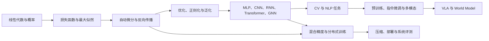
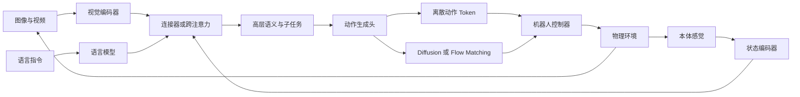

# 深度学习基础知识全景手册


## 执行摘要

深度学习可以视为四个相互耦合层次的统一：

第一，**统计学习问题**：从有限样本中学习一个在未知数据分布上具有较低期望风险的函数。第二，**可微分表示学习**：利用多层神经网络自动形成从低层模式到高层语义的层次化表示。第三，**随机数值优化**：通过反向传播、随机梯度和自适应优化器，在高维非凸参数空间中寻找有效解。第四，**计算系统工程**：通过数据流水线、混合精度、分布式并行、编译优化、量化与部署系统，把理论模型转化为可复现、可扩展的实际系统。

现代模型从 MLP、CNN、RNN 演进到 Transformer、图神经网络、多模态大模型、视觉语言动作模型和世界模型，但其基本训练范式仍然是：

$$
\text{数据}
\longrightarrow
\text{参数化模型}
\longrightarrow
\text{损失函数}
\longrightarrow
\text{自动微分}
\longrightarrow
\text{优化更新}
\longrightarrow
\text{泛化评估}.
$$

Transformer 通过基于注意力的并行序列建模取代了传统的循环依赖；ResNet 通过残差路径改善了深层网络优化；BatchNorm、LayerNorm 和 RMSNorm 等归一化方法则从不同维度改善激活与梯度的数值行为。

近两年的主要趋势是：视觉模型从封闭类别监督学习转向自监督基础模型、开放词汇检测和视频世界表征；语言模型从普通预训练与监督微调转向稀疏 MoE、长上下文、多模态原生建模和强化学习后训练；机器人学习从任务专用策略转向 OpenVLA、$\pi_0$、Gemini Robotics、GR00T 等视觉语言动作模型；世界模型则从 Dreamer 类潜在动力学模型扩展到 Genie、Cosmos 和 V-JEPA 等大规模视频或物理世界基础模型。

本文档为完整 Markdown 版本，包含公式推导、代码、表格、数据集、工具链和参考资料。

**核心结论：**

- 数学基础的重点不是手工计算大型网络，而是理解张量维度、概率假设、梯度路径、数值稳定性和泛化风险。
- 模型架构的本质是归纳偏置、计算复杂度、数据规模、并行性和部署限制之间的折中。
- 大多数实际性能问题首先来自数据、评测或训练系统，而不是模型不够新。
- “SOTA”只能在固定数据、训练预算、输入分辨率、预训练数据和评测协议下定义。
- 多模态模型解决多种信号的联合理解；VLA 进一步将理解映射为动作；世界模型则试图学习可供预测与规划使用的环境动力学。
- 研究结果应同时报告精度、参数量、计算量、吞吐量、显存、延迟、训练预算、随机种子和失败案例。

## 目录与使用方式

- [理论与数学基础](#math-foundations)
- [核心模型与架构](#core-models)
- [训练工程与部署](#training-engineering)
- [计算机视觉](#computer-vision)
- [自然语言处理多模态-vla-与世界模型](#nlp-multimodal-vla)
- [数据集指标工具链与参考文献](#datasets-metrics-tools)

推荐学习顺序：



对于研究者，建议按“数学—模型—论文复现—消融实验—分布外评测”推进。对于工程师，建议按“数据检查—小模型闭环—预训练迁移—性能分析—分布式训练—压缩部署”推进。《动手学深度学习》中文版提供了公式、图示和可运行代码相结合的学习材料；Hugging Face 中文课程覆盖 Transformers、Datasets、Tokenizers 和 Accelerate；OpenMMLab 则提供检测、分割等视觉任务的模块化工程框架。

**本节小结：** 不应在尚未建立完整训练与验证闭环前直接进入大模型训练。先在小数据、小模型上验证目标函数、梯度、指标和保存恢复逻辑，再扩展规模。

## 理论与数学基础 {#math-foundations}

**线性代数。** 神经网络的基本计算是张量变换。全连接层为

$$
\mathbf y=\mathbf W\mathbf x+\mathbf b,
$$

其中

$$
\mathbf{x}\in\mathbb{R}^{d_{\text{in}}},
\qquad
\mathbf{W}\in\mathbb{R}^{d_{\text{out}}\times d_{\text{in}}},
\qquad
\mathbf{y}\in\mathbb{R}^{d_{\text{out}}}.
$$

对于批量输入 $\mathbf X\in\mathbb{R}^{B\times d_{\text{in}}}$：

$$
\mathbf Y=\mathbf X\mathbf W^\top+\mathbf b.
$$

常用范数为

$$
\|\mathbf{x}\|_1=\sum_i|x_i|,
\qquad
\|\mathbf{x}\|_2=\sqrt{\sum_i x_i^2}.
$$

L1 范数常与稀疏正则化相关，L2 范数常用于权重衰减、距离度量和梯度裁剪。矩阵的特征值和奇异值决定线性变换对不同方向的放大程度；循环网络中反复出现的状态转移矩阵幂，是梯度消失或爆炸的重要来源。

**概率建模。** 给定数据集

$$
\mathcal D=\{(\mathbf x_i,y_i)\}_{i=1}^{n},
$$

经验风险最小化为

$$
\hat{\theta}
=
\arg\min_\theta
\hat R(\theta),
\qquad
\hat R(\theta)
=
\frac{1}{n}\sum_{i=1}^{n}
\ell(f_\theta(\mathbf x_i),y_i).
$$

真实风险为

$$
R(\theta)
=
\mathbb E_{(\mathbf x,y)\sim p_{\text{data}}}
[\ell(f_\theta(\mathbf x),y)].
$$

训练误差低只意味着 $\hat R(\theta)$ 较低，并不保证 $R(\theta)$ 较低。训练集与部署分布不一致时，还需要考虑域偏移、协变量偏移、标签偏移和概念漂移。

对分类模型，最大似然估计为

$$
\max_\theta
\sum_i
\log p_\theta(y_i\mid\mathbf x_i),
$$

等价于最小化负对数似然。Softmax 为

$$
p_c
=
\frac{\exp z_c}{\sum_j\exp z_j},
$$

多分类交叉熵为

$$
\mathcal L_{\mathrm{CE}}
=
-\frac1n
\sum_{i=1}^{n}
\sum_{c=1}^{C}
y_{ic}\log p_{ic}.
$$

实际实现应直接使用 `CrossEntropyLoss` 或 `log_softmax`，不要先手工计算 Softmax 再取对数，以免出现数值上溢或下溢。

**信息论。** 熵、交叉熵和 KL 散度分别为

$$
H(p)=-\sum_x p(x)\log p(x),
$$

$$
H(p,q)=-\sum_xp(x)\log q(x),
$$

$$
D_{\mathrm{KL}}(p\|q)
=
\sum_xp(x)\log\frac{p(x)}{q(x)}
=
H(p,q)-H(p).
$$

KL 散度用于变分推断、知识蒸馏、策略约束和分布对齐，但它不对称，也不满足一般距离的所有条件。

**反向传播。** 对复合函数

$$
z=f(g(x)),
$$

链式法则给出

$$
\frac{\partial z}{\partial x}
=
\frac{\partial z}{\partial g}
\frac{\partial g}{\partial x}.
$$

两层网络可写为

$$
\mathbf a
=
\mathbf W_1\mathbf x+\mathbf b_1,
\qquad
\mathbf h=\phi(\mathbf a),
$$

$$
\hat{\mathbf y}
=
\mathbf W_2\mathbf h+\mathbf b_2.
$$

若损失为 $\mathcal L$，则

$$
\frac{\partial\mathcal L}{\partial\mathbf W_2}
=
\frac{\partial\mathcal L}{\partial\hat{\mathbf y}}
\mathbf h^\top,
$$

$$
\frac{\partial\mathcal L}{\partial\mathbf W_1}
=
\left[
\mathbf W_2^\top
\frac{\partial\mathcal L}{\partial\hat{\mathbf y}}
\odot
\phi'(\mathbf a)
\right]\mathbf x^\top.
$$

反向传播不是优化算法，而是沿计算图高效计算向量—雅可比积的算法；SGD、Adam 等才负责利用梯度更新参数。

**随机优化。** 梯度下降为

$$
\theta_{t+1}
=
\theta_t-\eta_t\nabla_\theta\mathcal L(\theta_t).
$$

Momentum 为

$$
\mathbf v_t
=
\beta\mathbf v_{t-1}
+
(1-\beta)\mathbf g_t,
$$

$$
\theta_{t+1}
=
\theta_t-\eta\mathbf v_t.
$$

Adam 维护一阶与二阶矩：

$$
\mathbf m_t
=
\beta_1\mathbf m_{t-1}
+
(1-\beta_1)\mathbf g_t,
$$

$$
\mathbf v_t
=
\beta_2\mathbf v_{t-1}
+
(1-\beta_2)\mathbf g_t^2,
$$

$$
\hat{\mathbf m}_t
=
\frac{\mathbf m_t}{1-\beta_1^t},
\qquad
\hat{\mathbf v}_t
=
\frac{\mathbf v_t}{1-\beta_2^t},
$$

$$
\theta_{t+1}
=
\theta_t
-
\eta
\frac{\hat{\mathbf m}_t}
{\sqrt{\hat{\mathbf v}_t}+\epsilon}.
$$

Adam 最初被提出为一种利用梯度低阶矩自适应调整更新尺度的高效一阶优化方法；现代 Transformer 训练通常使用将权重衰减与梯度更新解耦的 AdamW。

| 优化器 | 状态开销 | 优点 | 局限 | 常见用途 |
|---|---:|---|---|---|
| SGD | 低 | 简单、稳定、易分析 | 对学习率敏感 | CNN 基线 |
| Momentum SGD | 一阶动量 | 减少震荡 | 仍需较细致调参 | 大规模视觉训练 |
| Adam | 一阶与二阶矩 | 收敛快，适合噪声或稀疏梯度 | 原始权重衰减语义不理想 | NLP、原型实验 |
| AdamW | 一阶与二阶矩 | 解耦 weight decay | 优化器状态显存较大 | Transformer、LLM |
| Adafactor | 因子化二阶状态 | 节约状态显存 | 行为更依赖实现和超参 | 超大矩阵参数 |

**正则化。** 常见目标为

$$
\mathcal L_{\mathrm{reg}}
=
\mathcal L_{\mathrm{data}}
+
\lambda\|\theta\|_2^2.
$$

其他方法包括 Dropout、数据增强、早停、标签平滑、Mixup、CutMix、随机深度和蒸馏。标签平滑为

$$
\tilde y_c
=
(1-\varepsilon)y_c+\frac{\varepsilon}{C}.
$$

Mixup 为

$$
\tilde x
=
\lambda x_i+(1-\lambda)x_j,
$$

$$
\tilde y
=
\lambda y_i+(1-\lambda)y_j.
$$

正则化并非越强越好；增强若改变标签语义，或 weight decay、dropout 过大，都会造成欠拟合。

**泛化。** 经典界通常具有

$$
R(f)
\leq
\hat R(f)
+
O\left(
\sqrt{
\frac{
\mathcal C(\mathcal F)+\log(1/\delta)
}{n}
}
\right)
$$

的形式，其中 $\mathcal C(\mathcal F)$ 是模型类复杂度。现代深度网络通常高度过参数化，仅靠参数数量无法充分解释泛化；初始化、优化轨迹、隐式正则化、数据结构、预训练和归一化都可能决定最终解。

**最小训练闭环：**

```python
import random
import numpy as np
import torch
from torch import nn
from torch.utils.data import DataLoader, TensorDataset

def seed_everything(seed: int = 42) -> None:
    random.seed(seed)
    np.random.seed(seed)
    torch.manual_seed(seed)
    torch.cuda.manual_seed_all(seed)

seed_everything()
device = torch.device("cuda" if torch.cuda.is_available() else "cpu")

x = torch.randn(4096, 20)
y = ((x[:, :3].sum(dim=1) + 0.2 * torch.randn(4096)) > 0).long()

loader = DataLoader(
    TensorDataset(x, y),
    batch_size=128,
    shuffle=True,
)

model = nn.Sequential(
    nn.Linear(20, 128),
    nn.ReLU(),
    nn.Dropout(0.1),
    nn.Linear(128, 2),
).to(device)

optimizer = torch.optim.AdamW(
    model.parameters(),
    lr=3e-4,
    weight_decay=1e-2,
)
criterion = nn.CrossEntropyLoss()

for epoch in range(10):
    model.train()
    total_loss = 0.0

    for xb, yb in loader:
        xb = xb.to(device)
        yb = yb.to(device)

        optimizer.zero_grad(set_to_none=True)
        logits = model(xb)
        loss = criterion(logits, yb)
        loss.backward()

        nn.utils.clip_grad_norm_(model.parameters(), 1.0)
        optimizer.step()

        total_loss += loss.item() * xb.size(0)

    print(
        f"epoch={epoch:02d}, "
        f"loss={total_loss / len(loader.dataset):.4f}"
    )
```

**本节小结：** 理论学习的最低目标是能够解释模型的概率假设、损失来源、梯度传播路径、优化器更新和泛化风险，并能将这些概念映射到实际代码。

## 核心模型与架构 {#core-models}

**MLP。**

$$
\mathbf h^{(l)}
=
\phi\left(
\mathbf W^{(l)}
\mathbf h^{(l-1)}
+
\mathbf b^{(l)}
\right).
$$

若没有激活函数，多层线性层仍等价于一个线性变换，因此深度本身不会增加函数类别。ReLU、GELU 和 SiLU 是常见激活。MLP 没有显式利用图像局部性、序列顺序或图拓扑，通常依赖输入表示或其他结构模块提供归纳偏置。

**CNN。** 二维卷积为

$$
Y_{n,c_o,h,w}
=
b_{c_o}
+
\sum_{c_i}
\sum_{i,j}
K_{c_o,c_i,i,j}
X_{n,c_i,h+i,w+j}.
$$

单维输出长度为

$$
L_{\mathrm{out}}
=
\left\lfloor
\frac{
L_{\mathrm{in}}+2P-D(K-1)-1
}{S}
+1
\right\rfloor.
$$

CNN 的核心归纳偏置是局部连接和权重共享。深度可分离卷积把空间卷积与通道混合分离，空洞卷积扩大感受野，特征金字塔则用于融合不同尺度的表示。

**RNN。**

$$
\mathbf h_t
=
\phi(
\mathbf W_{xh}\mathbf x_t
+
\mathbf W_{hh}\mathbf h_{t-1}
+
\mathbf b).
$$

RNN 需要按时间顺序递归，难以完全并行。反向传播通过时间展开形成矩阵乘积，因此容易出现长程梯度消失或爆炸。

**LSTM。**

$$
\mathbf i_t
=
\sigma(W_i[x_t,h_{t-1}]+b_i),
$$

$$
\mathbf f_t
=
\sigma(W_f[x_t,h_{t-1}]+b_f),
$$

$$
\mathbf o_t
=
\sigma(W_o[x_t,h_{t-1}]+b_o),
$$

$$
\tilde{\mathbf c}_t
=
\tanh(W_c[x_t,h_{t-1}]+b_c),
$$

$$
\mathbf c_t
=
\mathbf f_t\odot\mathbf c_{t-1}
+
\mathbf i_t\odot\tilde{\mathbf c}_t,
$$

$$
\mathbf h_t
=
\mathbf o_t\odot\tanh(\mathbf c_t).
$$

GRU 将记忆状态和隐藏状态合并，使用更新门与重置门，参数通常少于 LSTM。LSTM 和 GRU 仍适合流式识别、在线时序、小型边缘模型和低固定延迟场景。

**注意力。**

$$
\operatorname{Attention}(Q,K,V)
=
\operatorname{softmax}
\left(
\frac{QK^\top}{\sqrt{d_k}}+M
\right)V.
$$

缩放项用于避免点积方差随维度增加而使 Softmax 过度饱和，$M$ 用于因果或 padding 掩码。多头注意力为

$$
\operatorname{MHA}(X)
=
\operatorname{Concat}
(\operatorname{head}_1,\ldots,\operatorname{head}_H)
W^O.
$$

Transformer 原论文以注意力取代循环和卷积，在机器翻译中展示了更高并行性；标准全局注意力的时间和显存复杂度通常随序列长度呈 $O(L^2)$ 增长。

```python
import torch
from torch import nn

class MultiHeadSelfAttention(nn.Module):
    def __init__(
        self,
        d_model: int,
        n_heads: int,
        dropout: float = 0.0,
    ):
        super().__init__()

        if d_model % n_heads != 0:
            raise ValueError("d_model 必须能被 n_heads 整除")

        self.n_heads = n_heads
        self.d_head = d_model // n_heads
        self.qkv = nn.Linear(d_model, 3 * d_model)
        self.out = nn.Linear(d_model, d_model)
        self.dropout = dropout

    def forward(
        self,
        x: torch.Tensor,
        causal: bool = False,
    ) -> torch.Tensor:
        # x: [batch, length, d_model]
        batch, length, d_model = x.shape

        qkv = self.qkv(x).view(
            batch,
            length,
            3,
            self.n_heads,
            self.d_head,
        )
        q, k, v = qkv.unbind(dim=2)

        q = q.transpose(1, 2)
        k = k.transpose(1, 2)
        v = v.transpose(1, 2)

        y = torch.nn.functional.scaled_dot_product_attention(
            q,
            k,
            v,
            dropout_p=self.dropout if self.training else 0.0,
            is_causal=causal,
        )

        y = (
            y.transpose(1, 2)
            .contiguous()
            .view(batch, length, d_model)
        )
        return self.out(y)
```

**归一化。** BatchNorm 为

$$
\hat{x}
=
\frac{x-\mu_B}
{\sqrt{\sigma_B^2+\epsilon}},
\qquad
y=\gamma\hat x+\beta.
$$

BatchNorm 使用批统计量，适合批量较稳定的 CNN；LayerNorm 对每个样本的特征维进行归一化，不依赖 batch，适合 Transformer 和变长序列；GroupNorm 在通道组内归一化，常用于小 batch 检测或分割。BatchNorm 的原始工作报告了更高可用学习率、更弱初始化敏感性和明显训练加速，但其行为会受到 batch 大小及训练/推理统计差异影响。

RMSNorm 为

$$
\operatorname{RMSNorm}(x)
=
\frac{x}
{\sqrt{\frac1d\sum_i x_i^2+\epsilon}}
\odot g.
$$

它省略均值中心化，已广泛用于现代语言模型。2026 年的进一步理论工作继续研究 LayerNorm 在何种条件下可等价或近似替换为 RMSNorm。

**残差连接。**

$$
y=x+F(x).
$$

残差连接通过为信息和梯度提供短路径，使极深网络更容易优化。ResNet 原论文表明，将层学习目标改写为残差函数，能够显著改善深层网络的优化。

**图神经网络。** 通用消息传递形式为

$$
m_v^{(l)}
=
\operatorname{AGG}_{u\in\mathcal N(v)}
\phi^{(l)}
(h_v^{(l)},h_u^{(l)},e_{uv}),
$$

$$
h_v^{(l+1)}
=
\psi^{(l)}
(h_v^{(l)},m_v^{(l)}).
$$

GCN 可写为

$$
H^{(l+1)}
=
\sigma\left(
\tilde D^{-1/2}
\tilde A
\tilde D^{-1/2}
H^{(l)}
W^{(l)}
\right).
$$

GAT 则通过注意力为不同邻居分配不同权重，并可用于归纳式和传导式图学习。

| 架构 | 主要归纳偏置 | 训练并行性 | 长程依赖 | 典型场景 |
|---|---|---:|---:|---|
| MLP | 无显式结构 | 高 | 依输入表示 | 表格、分类头 |
| CNN | 局部性、权重共享 | 高 | 通过深度扩大 | 图像、音频 |
| RNN | 顺序递归 | 低 | 较弱 | 在线时序 |
| LSTM/GRU | 门控记忆 | 低 | 优于普通 RNN | 流式序列 |
| Transformer | 全局 token 交互 | 高 | 强但成本高 | NLP、视觉、多模态 |
| GNN | 图邻域与拓扑 | 中 | 依图结构和层数 | 分子、推荐、知识图谱 |

**本节小结：** Transformer 是通用性很强的架构，但并未使 CNN、RNN 或 GNN 失效。架构选择应以数据结构、训练规模、推理延迟、显存和部署硬件为依据。

## 训练工程与部署 {#training-engineering}

**数据优先。** 在训练前应检查：

- 训练、验证、测试集合是否存在用户级、视频级、患者级或近重复样本泄漏；
- 标签是否与输入同步；
- 类别分布和长尾程度；
- 缺失值、损坏样本、极端尺寸和异常长度；
- 文本是否包含测试集答案或评测污染；
- 图像、文本、音频及机器人数据是否满足许可证、隐私和合规要求。

类别不平衡可采用类别权重、重采样、Focal Loss 或阈值调整，但验证和测试集应尽量反映部署分布。

**数据增强。**

| 模态 | 常见增强 |
|---|---|
| 图像 | 裁剪、翻转、颜色扰动、RandAugment、Mixup、CutMix、Mosaic |
| 文本 | span corruption、回译、模板扰动、受约束同义改写 |
| 音频 | 时间遮挡、频率遮挡、噪声、速度扰动 |
| 视频 | 时间裁剪、帧采样、空间增强、速度变化 |
| 机器人 | 视角扰动、目标位姿扰动、动作噪声、仿真域随机化 |

增强必须保持任务标签语义。例如左右方向、医学病灶位置、字符识别和机器人坐标系通常不能直接使用无约束翻转。

**学习率调度。** Cosine 调度为

$$
\eta_t
=
\eta_{\min}
+
\frac12
(\eta_{\max}-\eta_{\min})
\left(
1+\cos\frac{\pi t}{T}
\right).
$$

常见策略包括线性 warmup、Cosine、OneCycle、Step 和 ReduceLROnPlateau。Warmup 可缓解训练初期参数、优化器矩估计和梯度尺度尚不稳定的问题，但它本质上仍是启发式，近年来仍有研究分析哪些参数化与优化条件会增加或减少对 warmup 的依赖。

**梯度控制。**

$$
g
\leftarrow
g
\min\left(
1,
\frac{\tau}{\|g\|_2}
\right).
$$

梯度裁剪适合 RNN、Transformer 和强化学习。梯度累积可模拟更大有效 batch，但会改变优化器更新次数、调度器步数和 BatchNorm 行为。梯度检查点通过重新计算前向激活来节省显存。

**混合精度。** PyTorch 的 `torch.amp` 支持在部分算子中使用低精度，同时保留需要更高动态范围的计算。FP16 通常需要 loss scaling；BF16 具有与 FP32 相同的指数位宽，往往更稳定。

```python
import torch
from torch import nn

device = torch.device("cuda")
model = nn.Sequential(
    nn.Linear(1024, 4096),
    nn.GELU(),
    nn.Linear(4096, 10),
).to(device)

optimizer = torch.optim.AdamW(model.parameters(), lr=1e-3)
scaler = torch.amp.GradScaler("cuda")

for x, y in train_loader:
    x = x.to(device, non_blocking=True)
    y = y.to(device, non_blocking=True)

    optimizer.zero_grad(set_to_none=True)

    with torch.amp.autocast("cuda", dtype=torch.float16):
        logits = model(x)
        loss = nn.functional.cross_entropy(logits, y)

    scaler.scale(loss).backward()
    scaler.unscale_(optimizer)

    nn.utils.clip_grad_norm_(model.parameters(), 1.0)

    scaler.step(optimizer)
    scaler.update()
```

**分布式训练。**

| 并行方法 | 切分对象 | 适用条件 | 主要成本 |
|---|---|---|---|
| 数据并行 DDP | 数据批次 | 模型能放入单卡 | 梯度 All-Reduce |
| FSDP/ZeRO | 参数、梯度、优化器状态 | 模型或状态过大 | 参数聚合与通信 |
| 张量并行 | 单层张量运算 | 超大矩阵层 | 高频设备间通信 |
| 流水线并行 | 网络层 | 层数多、设备多 | 流水线气泡 |
| 专家并行 | MoE 专家 | 稀疏 MoE | All-to-All |
| 上下文并行 | 序列维度 | 超长上下文 | 注意力通信 |

PyTorch DDP 为同步数据并行提供了标准封装；FSDP 则通过跨设备切分参数、梯度和优化器状态降低单卡内存占用。

```python
import os
import torch
import torch.distributed as dist
from torch.nn.parallel import DistributedDataParallel as DDP

def setup_distributed() -> int:
    dist.init_process_group(backend="nccl")
    local_rank = int(os.environ["LOCAL_RANK"])
    torch.cuda.set_device(local_rank)
    return local_rank

local_rank = setup_distributed()

model = MyModel().to(local_rank)
model = DDP(model, device_ids=[local_rank])

# DataLoader 应使用 DistributedSampler。
# 每个 epoch 调用 sampler.set_epoch(epoch)。
```

**超参数搜索。** Optuna 支持基于采样器和 pruner 的超参数优化，可以根据中间结果提前终止低潜力试验。

优先搜索顺序通常为：

1. 学习率；
2. 有效 batch size；
3. warmup 和训练步数；
4. weight decay；
5. dropout；
6. 数据增强强度；
7. 模型宽度、深度和输入尺寸。

应记录代码提交、数据版本、随机种子、硬件、库版本和完整配置。只保存“最佳指标”而不保存试验条件，几乎无法复现结果。

**模型压缩。**

$$
\mathcal L_{\mathrm{KD}}
=
\alpha\mathcal L_{\mathrm{hard}}
+
(1-\alpha)T^2
D_{\mathrm{KL}}
\left(
\sigma(z_s/T)
\|
\sigma(z_t/T)
\right).
$$

| 方法 | 作用 | 实际注意事项 |
|---|---|---|
| 非结构化剪枝 | 产生稀疏权重 | 没有稀疏内核时未必加速 |
| 结构化剪枝 | 删除通道、头、层 | 更容易获得实际加速 |
| INT8/INT4 量化 | 降低存储和带宽 | 依赖硬件与算子支持 |
| 蒸馏 | 学生模仿教师 | 需优质蒸馏数据 |
| 低秩分解 | 压缩大矩阵 | 低秩假设不总成立 |
| LoRA/Adapter | 降低微调成本 | 不直接降低基础模型推理成本 |
| Speculative decoding | 小模型提议、大模型验证 | 收益取决于接受率 |

ONNX Runtime 支持静态与动态量化、Transformer 特定优化和多种执行后端；在 GPU 上能否获得 INT8 收益取决于硬件及 TensorRT 等后端支持。

**部署路径。**

$$
\text{PyTorch 模型}
\rightarrow
\text{模型校验}
\rightarrow
\texttt{torch.compile/export}
\rightarrow
\text{ONNX 或 AOT 图}
\rightarrow
\text{运行时优化}
\rightarrow
\text{目标硬件基准测试}.
$$

`torch.compile` 用于优化 Python 模型或函数的执行；`torch.export` 面向可部署计算图；AOTInductor 可把导出图编译为可序列化部署产物。

部署评测至少应包括：

- P50、P95、P99 延迟；
- 首 token 延迟；
- tokens/s 或 samples/s；
- 峰值显存和常驻内存；
- 模型文件大小；
- 冷启动时间；
- 功耗；
- 动态 batch 和动态输入长度下的退化；
- 精度或成功率变化。

**调试顺序。**

1. 尝试在几十个样本上过拟合到接近零训练损失；
2. 检查标签、mask、特殊 token 和损失输入形状；
3. 关闭增强、AMP、编译和分布式；
4. 检查 `model.train()` 与 `model.eval()`；
5. 监控梯度范数、激活范围、学习率和 loss scale；
6. 检查 checkpoint 是否包含模型、优化器、调度器、scaler 和 RNG 状态；
7. 逐项恢复工程优化。

**本节小结：** 正确性优先于吞吐量，端到端指标优先于单算子速度。混合精度、编译和分布式应在单卡基线完全正确后逐步加入。

## 计算机视觉 {#computer-vision}

**图像分类。** 典型模型谱系包括 CNN、ResNet、EfficientNet、ViT、Swin Transformer、ConvNeXt 和自监督视觉基础模型。迁移学习通常采用：

$$
\text{预训练骨干}
+
\text{新分类头}
\rightarrow
\text{冻结训练}
\rightarrow
\text{逐层解冻微调}.
$$

```python
import torch
from torch import nn
from torch.utils.data import DataLoader
from torchvision import datasets, transforms
from torchvision.models import resnet18, ResNet18_Weights

device = torch.device(
    "cuda" if torch.cuda.is_available() else "cpu"
)

weights = ResNet18_Weights.DEFAULT

train_transform = transforms.Compose([
    transforms.RandomResizedCrop(224),
    transforms.RandomHorizontalFlip(),
    transforms.ToTensor(),
    transforms.Normalize(
        mean=weights.meta["mean"],
        std=weights.meta["std"],
    ),
])

validation_transform = weights.transforms()

train_set = datasets.ImageFolder(
    "data/train",
    transform=train_transform,
)
validation_set = datasets.ImageFolder(
    "data/val",
    transform=validation_transform,
)

train_loader = DataLoader(
    train_set,
    batch_size=64,
    shuffle=True,
    num_workers=4,
    pin_memory=True,
)

model = resnet18(weights=weights)
model.fc = nn.Linear(
    model.fc.in_features,
    len(train_set.classes),
)
model.to(device)

optimizer = torch.optim.AdamW(
    model.parameters(),
    lr=3e-4,
    weight_decay=1e-4,
)

for epoch in range(5):
    model.train()

    for images, labels in train_loader:
        images = images.to(device)
        labels = labels.to(device)

        optimizer.zero_grad(set_to_none=True)
        logits = model(images)
        loss = nn.functional.cross_entropy(logits, labels)
        loss.backward()
        optimizer.step()
```

分类不应只报告 Accuracy。长尾数据至少应报告 Macro-F1、每类 Recall、混淆矩阵和校准指标。

**目标检测。**

- Faster R-CNN：候选区域 + 分类回归；
- RetinaNet：单阶段密集检测，使用 Focal Loss；
- YOLO 系列：面向实时单阶段检测；
- DETR 系列：将检测建模为集合预测，通过二分图匹配分配目标。

交并比为

$$
\operatorname{IoU}(A,B)
=
\frac{|A\cap B|}{|A\cup B|}.
$$

COCO AP 通常在多个 IoU 阈值上平均，因此不能把 AP50 与 COCO 主 AP 混为一谈。2025 年的 YOLOE 将开放词汇提示、检测和分割进一步统一在实时框架中；RT-DETRv3 等工作则继续改进实时端到端 Transformer 检测。

**分割。**

- 语义分割：每个像素一个类别；
- 实例分割：区分同类实例；
- 全景分割：统一 thing 与 stuff；
- 可提示分割：使用点、框、文本或已有 mask 指定对象。

$$
\operatorname{Dice}
=
\frac{2|P\cap G|}
{|P|+|G|},
$$

$$
\operatorname{mIoU}
=
\frac1C
\sum_{c=1}^{C}
\frac{TP_c}
{TP_c+FP_c+FN_c}.
$$

U-Net 在医学图像和小数据分割中仍是强基线；DeepLab 使用空洞卷积；Mask R-CNN 同时预测框和实例掩码；Mask2Former 以掩码分类统一语义、实例和全景分割；SAM 系列推动了可提示分割和视频目标传播。2026 年的相关研究继续关注提示式视频分割的鲁棒性、交互训练和时空推理。

**目标跟踪。** Tracking-by-detection 的常见流程为：

$$
\text{检测器}
\rightarrow
\text{运动预测}
\rightarrow
\text{外观特征}
\rightarrow
\text{数据关联}
\rightarrow
\text{轨迹管理}.
$$

常用组件包括 Kalman Filter、匈牙利匹配和 ReID。指标包括 MOTA、IDF1 和 HOTA。MOTA 综合漏检、误检和身份切换，但可能掩盖检测与关联的不同错误；HOTA 将检测精度和关联精度分解得更清楚。

**视觉预训练。**

对比式图文对齐目标可写为

$$
\mathcal L
=
-\frac12
\left[
\frac1B
\sum_i
\log
\frac{\exp(s_{ii}/\tau)}
{\sum_j\exp(s_{ij}/\tau)}
+
\frac1B
\sum_i
\log
\frac{\exp(s_{ii}/\tau)}
{\sum_j\exp(s_{ji}/\tau)}
\right].
$$

主流范式包括：

- 监督预训练；
- 对比学习；
- 掩码图像建模；
- 自蒸馏；
- 图文对齐；
- 视频预测或联合嵌入预测。

截至 2026 年，DINOv3 是代表性的大规模自监督视觉表征模型，其冻结特征在多个分类、分割和遥感检测任务中表现突出；V-JEPA 2.1 继续推进图像与视频的稠密自监督特征和时空预测。

| 任务 | 常见数据集 | 主要指标 | 常用框架 |
|---|---|---|---|
| 分类 | ImageNet、CIFAR、iNaturalist | Top-1、Top-5、F1 | torchvision、timm |
| 检测 | COCO、LVIS、Open Images | AP、AP50、AP75 | MMDetection、Detectron2 |
| 语义分割 | ADE20K、Cityscapes | mIoU、mAcc | MMSegmentation |
| 医学分割 | BraTS、KiTS 等 | Dice、Hausdorff | MONAI |
| 多目标跟踪 | MOT17、MOT20 | HOTA、IDF1、MOTA | TrackEval |
| 视频理解 | Kinetics、SSv2 | Top-k、mAP | MMAction2、PyTorchVideo |

**CV 选型原则。**

- 小数据：优先预训练和适度增强；
- 小目标：增加分辨率、多尺度特征与针对性采样；
- 实时系统：同时评估预处理、后处理和数据传输；
- 开放世界：考虑图文预训练和开放词汇检测；
- 视频：显式处理时间关系，而不是只做独立帧推理；
- 医学与工业：报告分布外数据、校准和失败模式。

**本节小结：** 视觉领域已经从封闭类别预测转向预训练、提示驱动、开放词汇和视频时空理解。模型选择必须围绕标注成本、目标尺度、帧率和部署硬件展开。

## 自然语言处理、多模态、VLA 与世界模型 {#nlp-multimodal-vla}

**语言建模。** 自回归分解为

$$
p(x_{1:T})
=
\prod_{t=1}^{T}
p(x_t\mid x_{<t}).
$$

困惑度为

$$
\operatorname{PPL}
=
\exp\left(
-\frac1N
\sum_{i=1}^{N}
\log p(x_i\mid x_{<i})
\right).
$$

PPL 只能在相同语料预处理和 tokenizer 下直接比较。不同 tokenization 会改变 token 数量和每 token 对数似然。

**序列标注。** 对命名实体识别和槽位填充，可使用 Transformer 编码器加 token 分类头。CRF 的序列分数为

$$
s(x,y)
=
\sum_tP_{t,y_t}
+
\sum_tA_{y_{t-1},y_t}.
$$

CRF 在标签转移约束较强或数据较少时仍有价值。

**机器翻译与生成评测。** BLEU 基于 n-gram 精确率和长度惩罚；chrF 基于字符 n-gram；COMET 等学习指标利用预训练表示。自动指标应和人工评估共同使用，特别是忠实性、术语一致性、事实性和文化适配。

**检索增强问答。**

$$
p(y\mid x)
=
\sum_{d\in\mathcal D}
p_\eta(d\mid x)
p_\theta(y\mid x,d).
$$

RAG 应分开评测：

- 文档 Recall@K；
- 重排质量；
- 答案 EM/F1；
- 引用正确性；
- 依据忠实性；
- 无答案时的拒答；
- 权限和索引时效性。

**指令微调。** 高质量 SFT 数据通常包含 system、instruction、context 和 response。训练时应正确使用模型 chat template，并通常只对 assistant 响应 token 计算监督损失。数据去重、难度分布、多轮角色边界和答案质量通常比机械扩大样本数更重要。

**LoRA。**

$$
W'
=
W+\Delta W,
\qquad
\Delta W=BA,
$$

其中

$$
A\in\mathbb R^{r\times d_{\text{in}}},
\qquad
B\in\mathbb R^{d_{\text{out}}\times r},
\qquad
r\ll d.
$$

LoRA 减少可训练参数和优化器状态；QLoRA 进一步量化基础模型权重。但 PEFT 主要降低训练成本，不代表部署时可以完全移除基础模型。

**偏好优化。** DPO 目标为

$$
\mathcal L_{\mathrm{DPO}}
=
-\mathbb E
\log\sigma
\left(
\beta
\left[
\log\frac{\pi_\theta(y_w|x)}
{\pi_{\mathrm{ref}}(y_w|x)}
-
\log\frac{\pi_\theta(y_l|x)}
{\pi_{\mathrm{ref}}(y_l|x)}
\right]
\right).
$$

DeepSeek-R1 是利用强化学习激励推理能力的代表性公开报告；其工作说明，可验证奖励和强化学习能显著改变模型的推理行为，但模型评估仍需要考虑答案正确率、推理成本、稳定性和安全性。

**近期语言模型架构。**

DeepSeek-V3 采用稀疏 MoE、Multi-head Latent Attention、辅助损失自由负载均衡和多 token 预测；其总参数为 671B，每个 token 激活 37B 参数。Qwen3 同时提供 dense 和 MoE 架构，并覆盖从小模型到 235B 参数规模。

2025—2026 年的多模态技术报告进一步发展了以下方向：

- Qwen3-VL：dense 与 MoE 视觉语言模型、长交错上下文；
- Qwen3-Omni 与 Qwen3.5-Omni：统一文本、图像、视频、音频理解和生成；
- Gemma 4：dense/MoE、多模态和更高计算效率；
- Gemini 系列：原生多模态、长上下文与实时交互。

这些报告中的“领先”结论通常基于各自选定的基准、提示和推理设置，不能脱离评测协议做绝对排序。

**多模态融合。**

| 方法 | 结构 | 优点 | 局限 |
|---|---|---|---|
| 双塔对比 | 独立编码器 + 共享嵌入空间 | 检索高效 | 细粒度交互较弱 |
| 连接器 | 视觉编码器 + MLP/Q-Former + LLM | 易复用预训练组件 | 连接器可能成为瓶颈 |
| 跨注意力 | 一模态查询另一模态 | 交互充分 | 计算成本较高 |
| 统一 token | 多模态离散化后自回归 | 接口统一 | tokenizer 和训练复杂 |
| 多模态 MoE | 模态或 token 路由专家 | 容量大、计算稀疏 | 路由和通信困难 |
| 晚期融合 | 多模型输出加权 | 鲁棒、易替换 | 难以建模细粒度对应 |

跨模态检索常使用余弦相似度：

$$
s(i,t)
=
\frac{
f_I(i)^\top f_T(t)
}{
\|f_I(i)\|_2
\|f_T(t)\|_2
}.
$$

指标包括 Recall@K、Median Rank 和 mAP，并应分别评测 image-to-text 与 text-to-image。

**VLA。** 视觉语言动作模型学习

$$
\pi(a_{t:t+H}\mid o_{\le t},l),
$$

其中 $o$ 可以包含图像、视频、深度和机器人本体状态，$l$ 是语言指令，输出是单步动作或动作块。



代表性模型包括：

| 模型 | 核心特点 | 公开状态 |
|---|---|---|
| OpenVLA | 7B VLA，视觉编码器融合 DINOv2 与 SigLIP，支持 PEFT | 权重与代码公开 |
| $\pi_0$ | VLM + action expert，使用 flow matching 生成连续动作 | 论文与部分生态公开 |
| Gemini Robotics | 通用操作与具身推理，多形态适配 | 部分能力闭源 |
| GR00T N1 | 慢速视觉语言推理 + 快速扩散 Transformer 动作系统 | 模型与代码生态开放 |
| GR00T N1.7 | 面向跨形态人形机器人技能的更新开放模型 | 2026 年公开 |
| SmolVLA | 面向低成本与高效率机器人控制 | 开源方向 |
| StarVLA | 模块化 VLA 研究代码库 | 2026 年开源研究框架 |

OpenVLA 在 970,000 条真实机器人示范上训练，并公开了检查点、微调代码与 Open X-Embodiment 支持；$\pi_0$ 使用基于 VLM 的 flow-matching 动作专家；Gemini Robotics 强调平滑反应式控制、未见环境泛化和具身空间推理；GR00T N1 使用双系统结构，将视觉语言推理和实时动作生成分离。

截至 2026 年 8 月，Gemini Robotics 2 进一步强调长时视频理解、工具编排、多步骤任务进度判断与多机器人协作；NVIDIA 的 GR00T N1.7 则提供面向人形和跨形态机器人的开放后训练基础。

VLA 的关键难点不是单纯扩大模型，而是：

- 不同机器人动作空间和控制频率不统一；
- 相机、本体状态和动作时间戳不同步；
- 推理延迟破坏闭环稳定性；
- 互联网视觉语言知识可能在机器人微调时遗忘；
- 离线动作误差与真实成功率不一致；
- 接触、力控、碰撞和故障恢复需要独立安全层；
- 成功示范之外还需要失败轨迹和恢复数据。

**世界模型。** 在部分可观测环境中，可学习潜在状态

$$
z_t
\sim
q_\phi(
z_t
\mid
z_{t-1},
a_{t-1},
o_t
),
$$

以及先验动力学

$$
\hat z_t
\sim
p_\theta(
z_t
\mid
z_{t-1},
a_{t-1}
).
$$

观测和奖励模型为

$$
p_\theta(o_t\mid z_t),
\qquad
p_\theta(r_t\mid z_t).
$$

典型变分损失为

$$
\mathcal L
=
-\mathbb E_{q_\phi}
\left[
\log p_\theta(o_t\mid z_t)
+
\log p_\theta(r_t\mid z_t)
\right]
+
\beta
D_{\mathrm{KL}}
\left(
q_\phi(z_t|\cdot)
\|
p_\theta(z_t|\cdot)
\right).
$$

学到环境模型后，可以：

- 使用 MPC 或 CEM 搜索候选动作；
- 在潜在空间生成 imagined rollouts；
- 在想象轨迹上训练 actor 与 critic；
- 生成合成数据补充真实 replay。

DreamerV3 在潜在世界中学习策略，并报告使用统一配置覆盖 150 多种任务；其核心价值是通过归一化、目标变换和稳定训练技术提高跨领域适用性。

Genie 将视频 tokenizer、自回归动力学和潜在动作模型组合为可交互生成环境；Genie 2 和 Genie 3 进一步发展了由图像或文本生成实时可控世界的能力。

Cosmos 提供视频数据处理、tokenizer、预训练世界模型和后训练平台；2026 年的 Cosmos 3 将语言、图像、视频、音频和动作纳入统一 omnimodal 世界模型。

V-JEPA 2 使用超过一百万小时视频进行自监督预训练，再利用少量机器人交互数据训练动作条件世界模型，并展示了基于潜在预测的机器人规划；V-JEPA 2.1 继续增强稠密图像和视频表征。

高质量视频生成不等于合格的世界模型。用于规划的模型还必须满足：

- 动作条件与结果一致；
- 对象状态在离开视野后保持；
- 几何、接触和因果关系可靠；
- 长时间 rollout 不快速漂移；
- 对不确定性进行校准；
- 通过模型规划能提升真实闭环成功率。

**本节小结：** NLP 正从单任务系统转向基础模型、后训练和工具增强；多模态模型建立跨模态表示；VLA 将表示映射为机器人动作；世界模型则尝试学习能支持预测和规划的内部环境模拟器。

## 数据集、指标、工具链与参考文献 {#datasets-metrics-tools}

**常见数据集。**

| 领域 | 数据集 | 任务 | 关键注意事项 |
|---|---|---|---|
| 图像分类 | ImageNet、CIFAR、iNaturalist | 分类 | 长尾、许可证、分辨率 |
| 目标检测 | COCO、LVIS、Open Images | 检测 | 类别定义和 AP 协议 |
| 分割 | ADE20K、Cityscapes、COCO-Stuff | 语义/全景分割 | ignore label、裁剪策略 |
| 跟踪 | MOT17/20、LaSOT、TrackingNet | 多/单目标跟踪 | 官方评测脚本 |
| 视频 | Kinetics、Something-Something V2 | 动作识别 | 帧采样和时间关系 |
| 语言建模 | WikiText、C4 类语料 | 预训练 | 去重、污染、合规 |
| 翻译 | WMT | 机器翻译 | 年份和语言对 |
| 问答 | SQuAD、Natural Questions | 抽取式/开放域 QA | 答案别名与证据 |
| LLM | MMLU 类、GSM8K、HumanEval | 知识、数学、代码 | 数据污染和提示敏感 |
| 图文 | COCO Captions、Flickr30K | 检索、描述 | 双向检索评测 |
| 机器人 | Open X-Embodiment、DROID、LIBERO | 操作学习 | 动作空间异构 |
| 强化学习 | Atari、DM Control、Minecraft | 控制和规划 | 环境步数和训练预算 |

**基础指标。**

$$
\operatorname{Precision}
=
\frac{TP}{TP+FP},
$$

$$
\operatorname{Recall}
=
\frac{TP}{TP+FN},
$$

$$
F_1
=
2
\frac{
\operatorname{Precision}
\operatorname{Recall}
}{
\operatorname{Precision}
+
\operatorname{Recall}
},
$$

$$
\operatorname{RMSE}
=
\sqrt{
\frac1n
\sum_i
(\hat y_i-y_i)^2
}.
$$

指标必须对应真实错误成本。医学筛查可能更重视 Recall 与校准；欺诈检测可能更重视 PR-AUC；机器人应重视真实闭环成功率、碰撞率和人工接管次数，而不是只报告离线动作 MSE。

**LLM 与多模态评测矩阵。**

| 维度 | 指标或任务 | 主要风险 |
|---|---|---|
| 语言建模 | PPL | tokenizer 不一致 |
| 知识 | 多领域考试题 | 污染和文化偏差 |
| 数学 | exact match、pass rate | 答案抽取误差 |
| 代码 | pass@k | 采样设置不同 |
| 对话 | 人工偏好、LLM judge | 长度与位置偏差 |
| RAG | Recall@K、EM、faithfulness | 检索与生成混淆 |
| 视觉问答 | Accuracy、ANLS | OCR 与格式敏感 |
| 视频理解 | 时序问答、定位 | 静态捷径 |
| 安全 | 越狱、毒性、拒答 | 单一总分失真 |
| 系统 | TTFT、tokens/s、显存 | 硬件和 batch 不同 |

LLM 评判器可扩大评测规模，但相关综述指出，基于 LLM 的自然语言生成评测仍存在可靠性、偏差和一致性挑战，因此重要结论应辅以人工审核。

**推荐工具链。**

| 环节 | 推荐工具 |
|---|---|
| 基础训练 | PyTorch、JAX、TensorFlow |
| 模型生态 | Hugging Face Transformers、timm、torchvision |
| CV | MMDetection、MMSegmentation、Detectron2、MONAI |
| GNN | PyTorch Geometric、DGL |
| LLM 微调 | PEFT、TRL、Accelerate、DeepSpeed |
| 分布式 | DDP、FSDP、DeepSpeed、Megatron-LM |
| 超参搜索 | Optuna、Ray Tune |
| 实验管理 | MLflow、Weights & Biases、TensorBoard |
| 数据版本 | DVC、lakeFS、对象存储版本 |
| 部署 | torch.export、ONNX Runtime、TensorRT、Triton |
| 性能分析 | torch.profiler、Nsight Systems、Nsight Compute |
| 机器人 | LeRobot、OpenVLA、Isaac Lab、MuJoCo |
| 世界模型 | DreamerV3、V-JEPA 2、Cosmos |

ONNX Runtime 支持在不同硬件、操作系统和编程语言之间部署模型；MMDetection 和 MMSegmentation 提供模块化视觉任务实现；PyTorch Geometric 面向图、点云和流形等非规则数据。

**优先阅读的基础论文与资料：**

1. Rumelhart, Hinton, Williams，*Learning Representations by Back-Propagating Errors*。
2. Goodfellow、Bengio、Courville，*Deep Learning*。
3. Kingma、Ba，*Adam: A Method for Stochastic Optimization*。
4. Ioffe、Szegedy，*Batch Normalization*。
5. He 等，*Deep Residual Learning for Image Recognition*。
6. Vaswani 等，*Attention Is All You Need*。
7. Veličković 等，*Graph Attention Networks*。
8. Hafner 等，*Mastering Diverse Domains through World Models*。
9. Kim 等，*OpenVLA*。
10. Black 等，*$\pi_0$: A Vision-Language-Action Flow Model*。
11. Gemini Robotics Team，*Gemini Robotics*。
12. NVIDIA，*GR00T N1*。
13. NVIDIA，*Cosmos World Foundation Model Platform*。
14. Assran 等，*V-JEPA 2*。
15. DeepSeek-AI，*DeepSeek-V3* 与 *DeepSeek-R1*。
16. Qwen Team，*Qwen3*、*Qwen3-VL*、*Qwen3.5-Omni*。
17. Google，*Gemma 4 Technical Report*。
18. NVIDIA，*Cosmos 3: Omnimodal World Models for Physical AI*。

**中文优先资源：**

- 《动手学深度学习》中文版将数学、代码和真实数据实验结合，并提供可运行 Notebook。
- Hugging Face LLM 中文课程覆盖 Transformers、Datasets、Tokenizers、Accelerate 和 Hub。
- PyTorch 中文教程涵盖数据加载、网络构建、训练、保存和编译相关内容。
- MMDetection 提供目标检测的配置、训练、测试和自定义模型文档。

**研究与生产发布清单：**

- 明确目标任务、数据分布和错误成本；
- 保存数据版本、配置、依赖和随机种子；
- 建立简单但可靠的基线；
- 先验证小数据过拟合能力；
- 分离训练、验证、测试和分布外集合；
- 同时报告模型指标和系统指标；
- 使用相同训练预算进行消融；
- 检查预训练数据、许可证和隐私；
- 对 LLM/VLM 做污染、幻觉、引用和安全评测；
- 对 VLA 与世界模型做真实闭环验证；
- 在真实硬件和真实输入长度上测部署性能；
- 公开失败案例、置信区间和已知限制。

**本节小结：** 模型和排行榜会快速变化，但可靠研究流程相对稳定：清晰定义问题、控制变量、可复现训练、分解评测、报告限制，并最终以真实任务效用验证模型。
